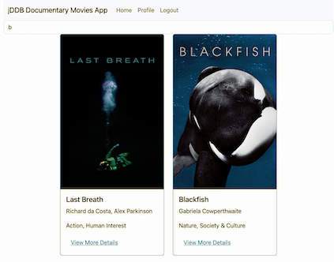

# jDDB Documentary Movie application

Users may create an account with JDDB, browse our documentary movie database, add and remove movies to their Favorites list, and delete their account if desired.

This application was configured with JavaScript using the MERN Stack (MongoDB, Express, React, and Node.js) with some styling assistance from Bootstrap.

Vist the complete application live here: [jDDB App](https://jddb.netlify.app/)

